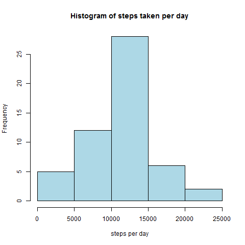
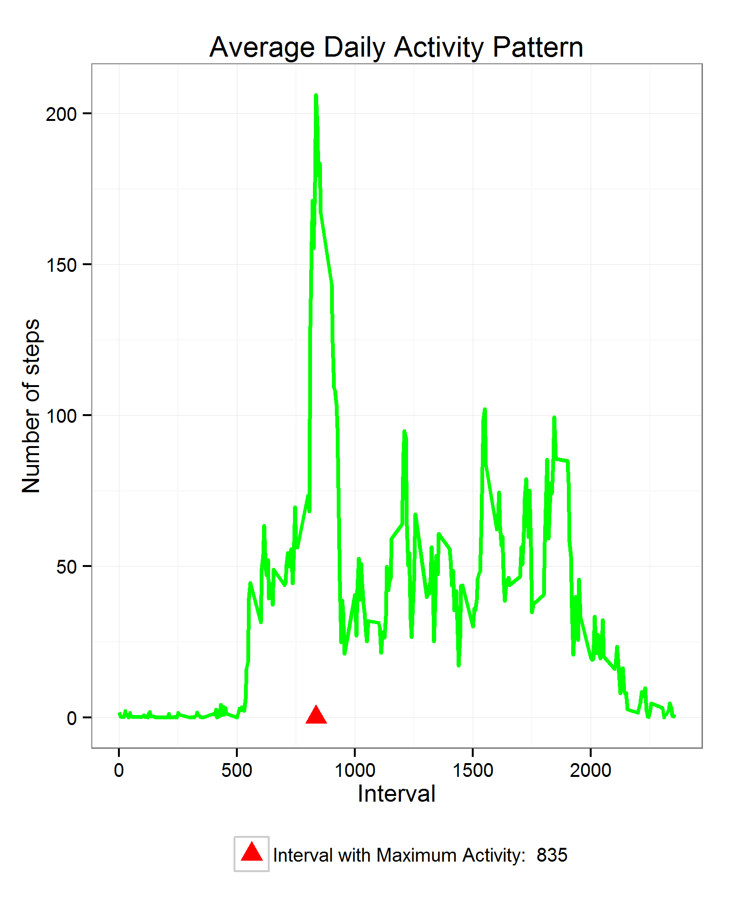
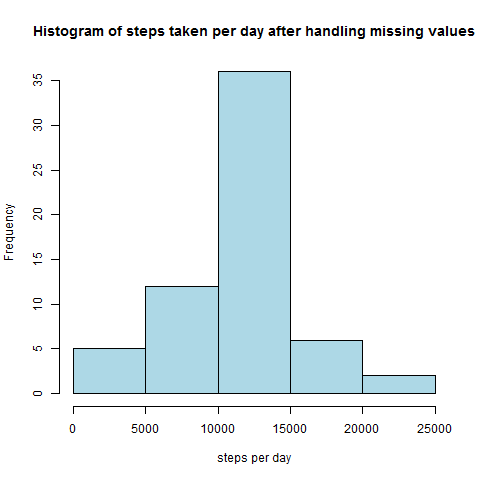
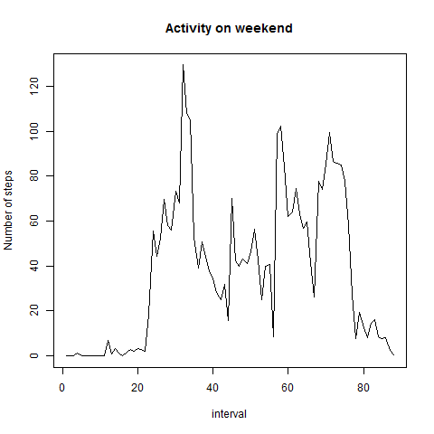
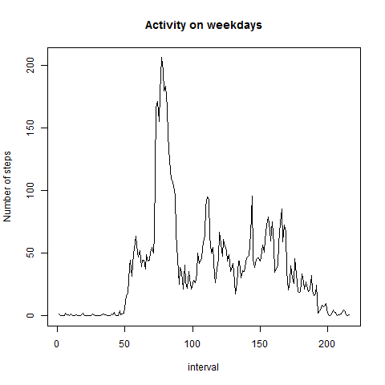

# Reproducible Research: Peer Assessment 1


## Loading and preprocessing the data


```r
unzip("activity.zip")
data <- read.csv("activity.csv")
attach(data)
```

## What is mean total number of steps taken per day?

```r
steps_taken_per_day <- aggregate(steps ~ date, data, sum)$steps
png("figures\\steps_taken_per_day.png",bg = "white",width = 480, height = 480)
hist(steps_taken_per_day, plot = TRUE, col = "lightblue", border = "black",main = "Histogram of steps taken per day",xlab="steps per day", ylab="Frequency")
dev.off()
```

 


Mean:

```r
mean(steps_taken_per_day)
```

```
## [1] 10766.19
```


Median:

```r
median(steps_taken_per_day)
```

```
## [1] 10765
```


## What is the average daily activity pattern?


```r
library(ggplot2)
plot_activity_pattern <- function(steps_per_interval, max_step_interval) {
  col_labels = c(paste("Interval with Maximum Activity: ", max_step_interval))
  cols = c("red")
  
  g <- ggplot(steps_per_interval, aes(x = interval, y = steps)) + 
         geom_line(color = "green", size = 1) + 
         geom_point(aes(x = max_step_interval, y = 0, color = "red"), size = 4, shape = 17) + 
         scale_color_manual(name = element_blank(), labels = col_labels, values = cols) + 
         labs(title = "Average Daily Activity Pattern", x = "Interval", y = "Number of steps") + 
         theme_bw() + theme(legend.position = "bottom")
  ggsave("figures\\activity_pattern.png", plot = g)
  dev.off()
}
steps_per_interval <- aggregate(steps ~ interval, data, mean)
max_step_interval <- steps_per_interval[which.max(steps_per_interval$steps), ]$interval
plot_activity_pattern(steps_per_interval, max_step_interval)
```

 

## Which 5-minute interval, on average across all the days in the dataset, contains the maximum number of steps?


```r
max_step_interval <- steps_per_interval[which.max(steps_per_interval$steps), ]$interval
max_step_interval
```

```
## [1] 835
```

## Imputing missing values

1. Calculate and report the total number of missing values in the dataset (i.e. the total number of rows with NAs)

```r
sum(is.na(steps))
```

```
## [1] 2304
```

2. Devise a strategy for filling in all of the missing values in the dataset. The strategy does not need to be sophisticated. For example, you could use the mean/median for that day, or the mean for that 5-minute interval, etc.
lets use the means for the 5-minute intervals as fillers for missing values. 

3.Create a new dataset that is equal to the original dataset but with the missing data filled in.

```r
activity <- merge(data, steps_per_interval, by = "interval", suffixes = c("",".y"))
nas <- is.na(activity$steps)
activity$steps[nas] <- activity$steps.y[nas]
activity <- activity[, c(1:3)]
```

4.Make a histogram of the total number of steps taken each day and Calculate and report the mean and median total number of steps taken per day. Do these values differ from the estimates from the first part of the assignment? What is the impact of imputing missing data on the estimates of the total daily number of steps?

```r
imputed_steps_taken_per_day <- aggregate(steps ~ date, activity, sum)$steps
png("figures\\imputed_steps_taken_per_day.png",bg = "white",width = 480, height = 480)
hist(imputed_steps_taken_per_day, plot = TRUE, col = "lightblue", border = "black",main = "Histogram of steps taken per day after handling missing values",xlab="steps per day", ylab="Frequency")
mean_of_steps <- round(mean(imputed_steps_taken_per_day),2)
median_of_steps <- round(median(imputed_steps_taken_per_day),2)
dev.off()
```

 


New mean

```r
mean_of_steps <- round(mean(imputed_steps_taken_per_day),2)
mean_of_steps
```

```
## [1] 10766.19
```


New median

```r
median_of_steps <- round(median(imputed_steps_taken_per_day),2)
median_of_steps
```

```
## [1] 10766.19
```

Comparing with the calculations done in the first section of this document, we observe that while the mean value remains unchanghed, the median value has shifted closer to the mean.


## Are there differences in activity patterns between weekdays and weekends?

Activity on weekends:

```r
weekdays <- c("Sunday", "Monday", "Tuesday", "Wednesday", "Thursday", "Friday", 
              "Saturday")[as.POSIXlt(date)$wday + 1]
weekend <- weekdays == "Sunday" | weekdays == "Saturday"
activity$weekend = weekend
weekday_activities <- aggregate(steps ~ weekend + interval, activity, mean)
png("figures\\Activity_on_weekend.png",bg = "white",width = 480, height = 480)
plot(weekday_activities[weekday_activities$weekend == T, ]$steps, type = "l", main = "Activity on weekend", xlab= "interval", ylab = "Number of steps" )
dev.off()
```

 

Activity on weekdays:

```r
png("figures\\Activity_on_weekdays.png",bg = "white",width = 480, height = 480)
plot(weekday_activities[weekday_activities$weekend == F, ]$steps, t = "l", main = "Activity on weekdays", xlab= "interval", ylab = "Number of steps")
dev.off()
```

 


The activity on weekends seems to be more compared to weekdays.We can infer as subject may be walking more on weekends and in the evening.
